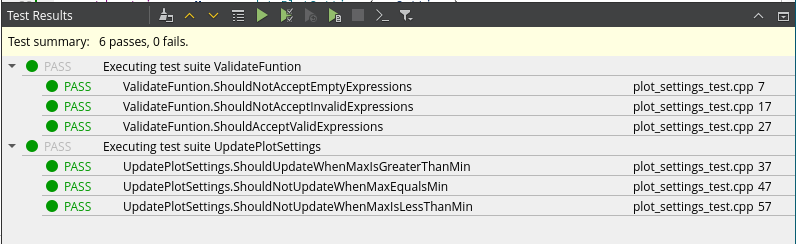
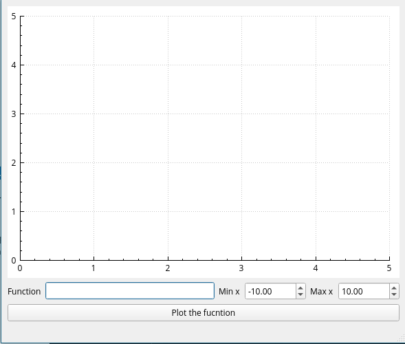
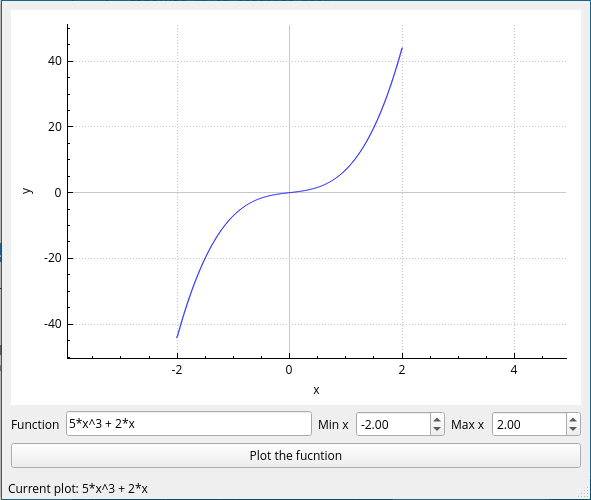
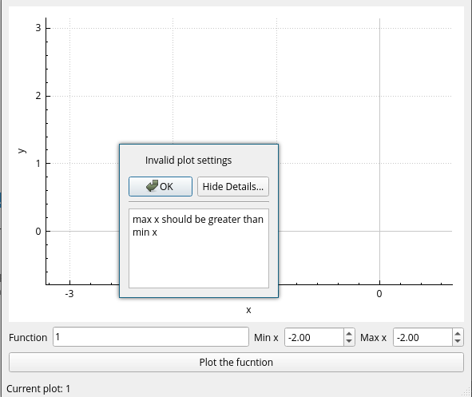
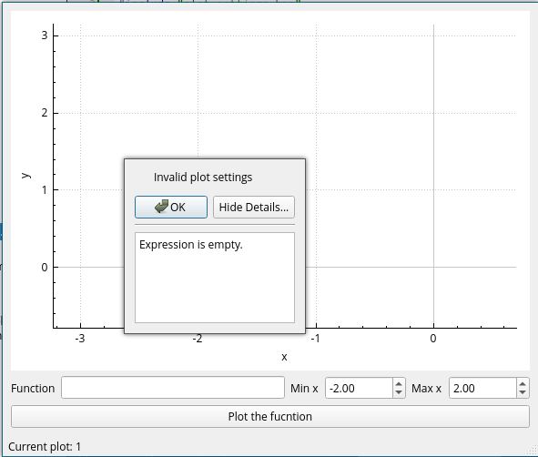
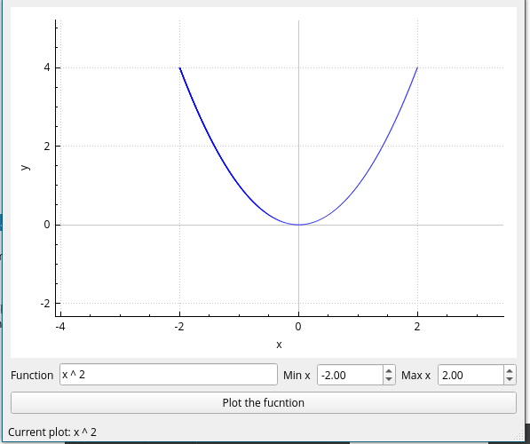

# Function Plotter

A cross platform GUI application built with QT and C++ to plot explicit mathematical functions 📊📈🌠

## Run the app

This app is developed using Qt Creator IDE on Arch Linux operating system. It is better to use it to modify and run the app in order to avoid unexpected errors.

You can also run it with CMake command:

```bash
cmake -B build/
make -C build/
./build/src/function-plotter
```

## Tests

I have used [`gtest`](https://github.com/google/googletest) as the testing framework with tests under the directory `tests/`. You can use Qt Creator IDE to easily run the tests and you should see these pleasing greed circles ✅:



> *Note:* you have to install the needed libraries ([gtest](https://github.com/google/googletest), [muParser](https://beltoforion.de/en/muparser/), and [Qt v6](https://www.qt.io/download-qt-installer)). It will differ from OS to another.

An alternative way to run tests is to use the terminal with `cmake` and `ctest` command like this:

```bash
cmake -S tests/ -B build-tests/
cd build-tests/
make
./function-plotter-test
```

## Screenshots










